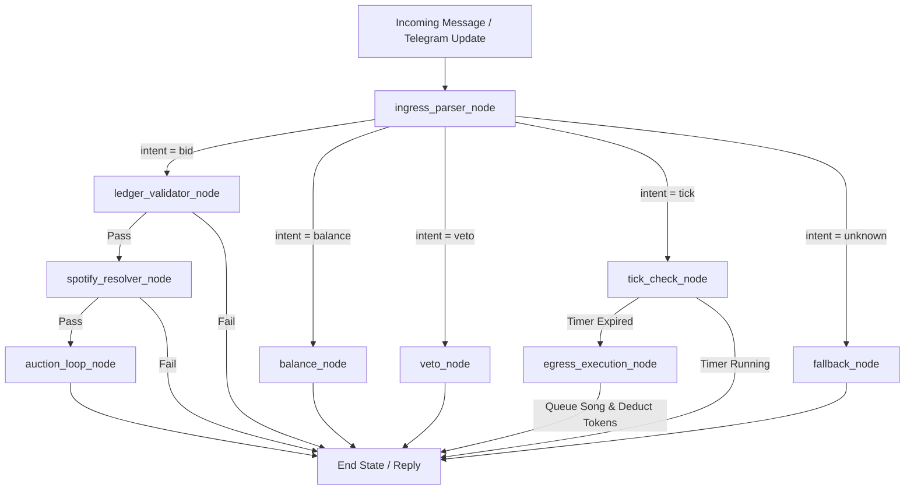

# Aux Cord Auction Bot 🎧

[](https://www.python.org/downloads/)
[](https://github.com/langchain-ai/langgraph)
[](https://developer.spotify.com/)
[](https://core.telegram.org/bots)
[](LICENSE)

An event-driven, state-machine bot orchestrating group chat auctions for shared music playback. Chat members bid **"Vibe Tokens"** in real time to queue songs on a host's Spotify player. 

Built with **LangGraph**, **Python 3.12**, **Spotify Web API**, **OpenAI GPT-4o-mini**, and **Telegram**.

---

## Key Features

* **Stateful Architecture:** Powered by **LangGraph**, utilizing cyclic state graphs and thread-isolated memory checkpointers to support multiple concurrent group chats independently.
* **Hybrid NLP Parsing Pipeline:**
  * **Deterministic First (Zero Cost):** High-speed regex engine parses standard commands (`!bid`, `!balance`, `!veto`) in milliseconds for $0 API spend.
  * **LLM Fallback (`GPT-4o-mini`):** Handles complex, slang-filled, or unstructured messages via OpenAI Structured Outputs (`with_structured_output(ParsedCommand)`).
* **⏱️ Anti-Snipe Protection Protocol:** Automatically extends the auction timer by `SNIPE_EXTENSION_SECONDS` when bids are placed in the closing seconds of a round.
* **Auth Architecture:**
  * **Search:** Uses Spotify Client Credentials flow (public catalog search).
  * **Playback Control:** Uses Spotify Authorization Code / PKCE flow to safely push winning tracks to the host's active playback queue.
* **Telegram Long-Polling Ingress:** Runs out-of-the-box locally via **Telegram Long-Polling** (no ngrok, public URL, or open ports required).

---

## System Architecture



---

## 🚀 Quickstart Guide

### Prerequisites
* **Python 3.12+** installed
* A **Spotify Developer Account** ([Spotify Dashboard](https://developer.spotify.com/dashboard))
* A **Telegram Bot Token** from [@BotFather](https://t.me/BotFather)

### 1. Clone & Install Dependencies

```bash
git clone https://github.com/patilshrinivas078/spotifyaux-bot.git
cd spotify-aux-bot

# Using uv (recommended)
uv sync

# Or using standard pip
pip install -r requirements.txt
```

### 2. Configure Environment Variables

Edit `.env` with your credentials:

```env
# Spotify Developer Credentials
SPOTIFY_CLIENT_ID="your_spotify_client_id"
SPOTIFY_CLIENT_SECRET="your_spotify_client_secret"
SPOTIFY_REDIRECT_URI="http://127.0.0.1:8000/callback"

# Telegram Bot Token (from @BotFather)
TELEGRAM_BOT_TOKEN="your_telegram_bot_token"

# Optional: LLM Fallback (OpenAI)
OPENAI_API_KEY="sk-proj-your-key"
USE_LLM_FALLBACK="false"

# Auction Tuning
STARTING_TOKEN_BALANCE=100
AUCTION_DURATION_SECONDS=30
SNIPE_WINDOW_SECONDS=10
SNIPE_EXTENSION_SECONDS=30
```

### 3. Register Redirect URI in Spotify Dashboard
1. Go to your app on [Spotify Developer Dashboard](https://developer.spotify.com/dashboard).
2. Click **Settings** $\rightarrow$ Under **Redirect URIs**, add `http://127.0.0.1:8000/callback`.
3. Save changes.

### 4. Run the Bot

Start the Telegram Bot runner:

```bash
python telegram_app.py
```

---

## 🎮 How to Use in Telegram

1. Add your bot to any Telegram group chat.
2. Promote the bot to **Admin** (or disable Group Privacy in `@BotFather`).
3. Open Spotify on your computer or phone and start/pause a track.
4. Start bidding in the group chat!

### Chat Commands

| Command | Example | Description |
|---|---|---|
| **Bid (Explicit)** | `!bid Espresso by Sabrina Carpenter 20` | Starts or outbids an active round for a song |
| **Bid (Natural)** | `queue Levitating and bid 30 tokens` | Natural language bidding syntax |
| **Check Balance** | `!balance` | Displays your remaining Vibe Tokens |
| **Veto Round** | `!veto` | Cancels the current round (no tokens deducted) |

---

## Running Tests

To run the offline integration test walkthrough (requires zero network or API credentials):

```bash
python test_walkthrough.py
```

---

## 📄 License

This project is licensed under the [MIT License](LICENSE).
